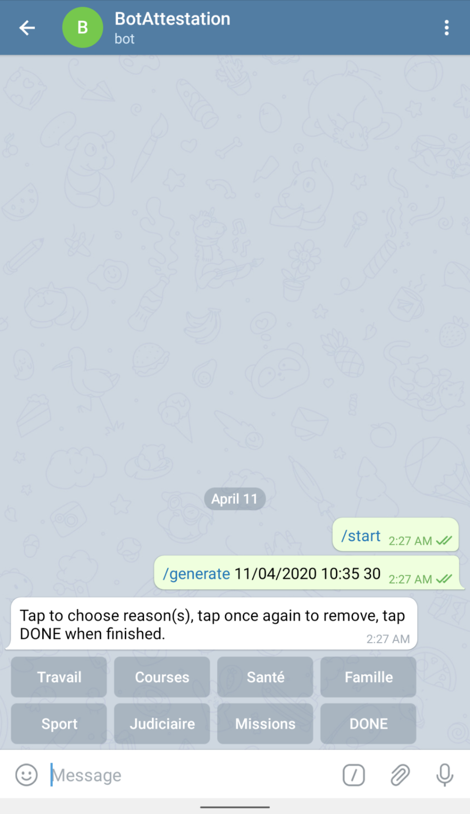
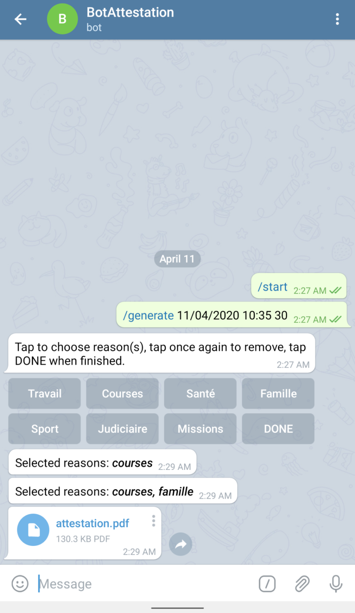

# AttestationBot

## Overview

This Telegram bot generates a custom confinement form on the fly with the possibility to specify the creation time/date.

## Getting started

To roll your own bot just follow these steps:

1. Create your bot in Telegram and get the API token, instructions: [Creating a new bot](https://core.telegram.org/bots#6-botfather).
2. Use the `\setcommands` to create the `generate` command for your bot.
3. Send a message to you bot and visit the link `https://api.telegram.org/bot**YourBOTToken**/getUpdates` in order to retrieve the **chat id**.
4. Clone this repository: `git clone https://github.com/khllkcm/AttestationBot.git`.
5. Go to the project directory: `cd AttestationBot`.
6. Fill out the `.env` file with your information.
7. Install the dependencies: `npm install`.
8. Make sure to install [forever](https://github.com/foreversd/forever): `[sudo] npm install forever -g`.
8. Start the bot: `forever src/app.js`.

## Usage

The main (and only) command is `\generate DATE TIME DELAY`.

`DATE` is the date on which you plan to go out, it has to be formatted as DD/MM/YYYY.

`TIME` is the time on which you plan to go out, it has to be formatted as HH:MM.

`DELAY` is the number of minutes before `TIME` that will be inscribed as the form creation time. For example, if you plan on leaving your house at 10:00 and you use a delay of 20, the form will have a creation time of 9:40. This is useful for creating a form on the spot but still, #STAYHOME.

The bot will reply asking you for the reasons you will be going out. Tap to select, tap again to deselect. 

The bot will inform you of which reasons are currently selected and once you tap *DONE* it will generate the form.

# Disclaimer

The code for generating the PDF file borrows heavily from [the official implementation](https://github.com/LAB-MI/deplacement-covid-19) by the French Interior Ministry in order to ensure complete compliance. It is a pure NodeJS version of the ES6 code they used that has been simplified and refactored.
